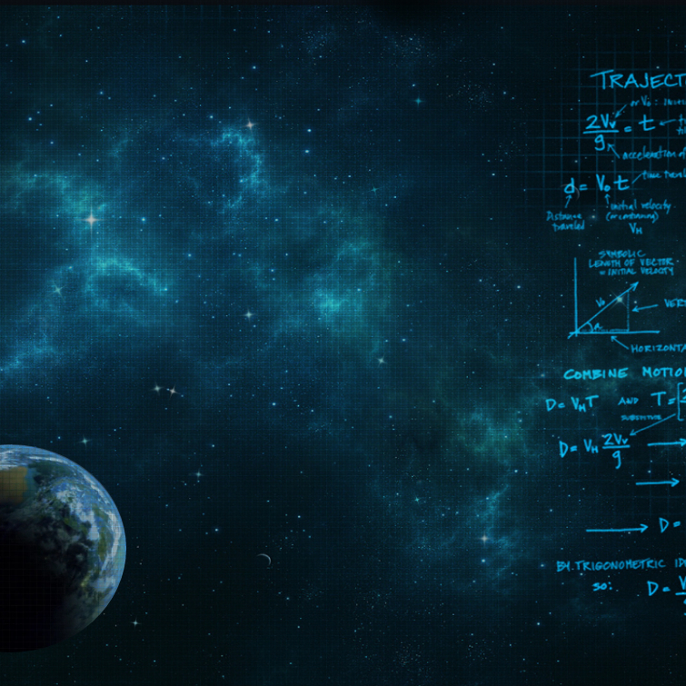

# [**Theories_Of_The_Universe**](http://steamcommunity.com/sharedfiles/filedetails/?id=848592407)

Producted By >>[Mashiro_Sorata](http://steamcommunity.com/id/Mashiro-Sorata/)

**#WALLPAPER ENGINE PROJECT#**

<h5>星空闪烁+星球转动</h5>

***
## Description(描述)：
###### 壁纸已经完成，一共7个可调整项：

1. 闪动位移范围：值越大，星星抖动越厉害；
2. 闪动速度：星星闪动变化的速度，值越大变化也就越快，增大可获取更好的效果；
3. 星星个数：可选择星星的个数，目前只有15颗，以后应该会增加；
4. 闪动概率：星星闪动变化的概率，值越大变化概率也就越大，增大至最大值星星每次刷新都会变化，减小至合适值可获取更好地效果；
5. 壁纸显示方式：有拉伸，填充，适应，如同桌面壁纸设置；
6. 是否显示星球：如字面意思，可设置星球是否可见；
7. 星球转动速度：设置星球自转速度。
8. 调整星星个数时，星星随机显示。
***
## ChangeLog(更新日志)：
 ### 2017年
>* ##### update1.01：更新于>1月25日>下午10:40
&nbsp;&nbsp;&nbsp;&nbsp;&nbsp;&nbsp;&nbsp;&nbsp;优化了部分代码，增添了一颗星星。
* ##### update1.10：更新于>1月30日>下午8:25
&nbsp;&nbsp;&nbsp;&nbsp;&nbsp;&nbsp;&nbsp;&nbsp;此次更新优化了大部分的代码，把星星个数增加到15个，还增加了两个可选项（闪动概率以及壁纸显示方式）。
下一步就是增加星星，以及星球转动的问题了。
* ##### update2.00：更新于>2月5日>下午7:51
&nbsp;&nbsp;&nbsp;&nbsp;&nbsp;&nbsp;&nbsp;&nbsp;此次更新的壁纸已经完成，又新增了2个选项，一共7个可调整项。
新增： 
&nbsp;&nbsp;&nbsp;&nbsp;&nbsp;&nbsp;&nbsp;&nbsp;1.是否显示星球：如字面意思，可设置星球是否可见； 
&nbsp;&nbsp;&nbsp;&nbsp;&nbsp;&nbsp;&nbsp;&nbsp;2.星球转动速度：值越大，星球转动速度越快。 
&nbsp;&nbsp;&nbsp;&nbsp;&nbsp;&nbsp;&nbsp;&nbsp;还有一个算作小彩蛋的地方：点击星球那部分可以暂停转动，再次点击可继续转动。
后续还会增加星星的数量以及优化的。
* ##### update2.01：更新于>2月7日>下午6:29
&nbsp;&nbsp;&nbsp;&nbsp;&nbsp;&nbsp;&nbsp;&nbsp;此次更新解决了单机星球后不能暂停的bug。
* ##### update2.02：更新于>3月5日>下午2:02
&nbsp;&nbsp;&nbsp;&nbsp;&nbsp;&nbsp;&nbsp;&nbsp;新增了6颗星星的显示。
* ##### update2.10：更新于>7月14日>下午11:41
&nbsp;&nbsp;&nbsp;&nbsp;&nbsp;&nbsp;&nbsp;&nbsp;1.优化了主程序部分的代码，占用CPU资源更少； 
&nbsp;&nbsp;&nbsp;&nbsp;&nbsp;&nbsp;&nbsp;&nbsp;2.改动：调整星星个数时星星随机显示。

---
## PS(备注)：
>目前考研暂时不会动这个项目了，大概吧……
